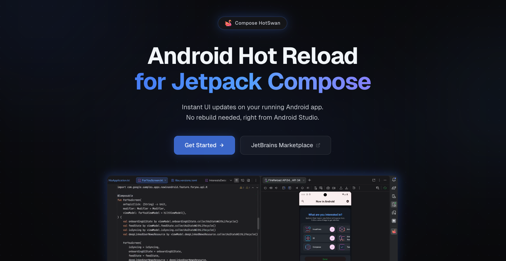
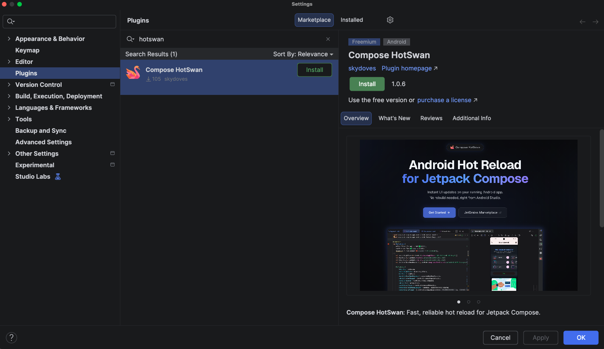

<p align="center">

</p>

<p align="center">
  <a href="https://plugins.jetbrains.com/plugin/30551-compose-hotswan/"></a>
  <a href="https://android-arsenal.com/api?level=28"></a>
  <a href="https://discord.gg/jaTcyK5XCr"></a>
  <a href="https://github.com/doveletter"></a><br>
</p>

<p align="center">
<a href="https://hotswan.dev/">Compose HotSwan</a> is a JetBrains IDE plugin & compiler plugin that enables instant hot reload for Jetpack Compose on "real" Android devices. Edit your Compose UI code, save the file, and see your changes reflected on a real device in seconds, without rebuilding or restarting the app.
</p>

## How It Works

[Compose HotSwan](https://hotswan.dev/) uses incremental Kotlin compilation combined with runtime class swapping on the Android Runtime (ART) to deliver fast, reliable hot reload in real Android devices. When you save a file, HotSwan compiles only the changed code, extracts modified classes, pushes them to the connected device, and triggers Compose recomposition. The entire pipeline typically completes in under a few seconds.

For a detailed breakdown, visit the [How It Works](https://hotswan.dev/docs/how-it-works) documentation.

## Issue Tracker

This repository serves as the public issue tracker for [Compose HotSwan](https://hotswan.dev/). You can use this repository to report bugs, request features, and track known issues.

- **Bug reports**: If you encounter unexpected behavior, crashes, or compilation errors, please [open an issue](https://github.com/skydoves/compose-hotswan-issuetracker/issues/new) with your IDE version, plugin version, Kotlin version, and steps to reproduce.
- **Feature requests**: Have an idea for improving HotSwan? Open an issue describing your use case and the expected behavior.
- **Questions**: For general questions, check the [Troubleshooting](https://hotswan.dev/docs/troubleshooting) documentation or the [FAQ](https://hotswan.dev/faq) first.
- **Community**: Join the [Discord server](https://discord.gg/jaTcyK5XCr) to discuss HotSwan, share feedback, and connect with other users.

## Features

- **Instant hot reload**: Apply UI changes to a running Android app without rebuilding or restarting. Your navigation stack, scroll position, ViewModel state, and `remember {}` values all stay intact.
- **Broad change support**: Modify composable function bodies, non composable functions, layout parameters, animations, conditional logic, resource values, data classes, and ViewModel methods.
- **Multi module**: File paths are automatically resolved to the correct Gradle module. Changes in any module are compiled and pushed independently.
- **Screenshot snapshot**: Every hot reload automatically captures a device screenshot paired with a code diff. Browse a visual timeline of your changes, revert code to any previous snapshot, and export reports for design collaboration.
- **AI integration**: Use Claude Code, Cursor, GitHub Copilot, or any AI tool that edits files on disk. HotSwan detects file changes, compiles, and pushes updates to the device automatically.
- **MCP Server**: Connect AI assistants via the Model Context Protocol to iterate on your UI with natural language, seeing each change reflected on the device in real time.
- **Debug only**: The Gradle plugin adds the client library as `debugImplementation` only. Release builds have zero overhead.

Explore the full feature set at [hotswan.dev/docs](https://hotswan.dev/docs).

## Getting Started

### 1. Install the Android Studio Plugin

Open your Android Studio and navigate to **Settings** > **Plugins** > **Marketplace**, search for **Compose HotSwan**, and install it. Restart your IDE when prompted.



### 2. Add the Gradle Plugin

Add the plugin to the `[plugins]` section of your `libs.versions.toml` file. Check the [latest version](https://hotswan.dev/docs/releases) for the version number.

```toml
[plugins]
hotswan-compiler = { id = "com.github.skydoves.compose.hotswan.compiler", version = "version" }
```

Register the plugin in your root `build.gradle.kts` with `apply false`:

```kotlin
plugins {
    alias(libs.plugins.hotswan.compiler) apply false
}
```

Then apply it in your app module's `build.gradle.kts`:

```kotlin
plugins {
    alias(libs.plugins.hotswan.compiler)
}
```

Sync your project. The plugin auto configures everything for debug builds.

### 3. Start Hot Reloading

1. Build and run your app on a device or emulator as usual.
2. Open the HotSwan panel: **View** > **Tool Windows** > **HotSwan**.
3. Select your connected device and click **Start**.
4. Edit any Kotlin file, press **Cmd+S** (or **Ctrl+S**), and watch the device update.

### Gradle Configuration

You can customize the plugin behavior in your `build.gradle.kts`:

```kotlin
hotSwanCompiler {
    enabled = true      // Master switch (default: true)
    debugOnly = true    // Apply only to debug builds (default: true)
}
```

For full configuration options, visit the [Gradle Configuration](https://hotswan.dev/docs/gradle-configuration) documentation.

## Requirements

| Requirement | Minimum Version |
|---|---|
| Android API | 28+ (API 30+ recommended) |
| IDE | IntelliJ IDEA 2024.3+ / Android Studio Meerkat+ |
| Kotlin | 2.3.0+ |
| Android Gradle Plugin | 8.7.3+ |

See the full [Requirements](https://hotswan.dev/docs/requirements) documentation for IDE version compatibility details.

## Documentation

Visit [hotswan.dev/docs](https://hotswan.dev/docs) for the complete documentation, including:

- [Why HotSwan](https://hotswan.dev/docs/why-hotswan)
- [Supported Changes](https://hotswan.dev/docs/supported-changes)
- [State Preservation](https://hotswan.dev/docs/state-preservation)
- [Screenshot Snapshot](https://hotswan.dev/docs/snapshot)
- [Hot Reload with AI](https://hotswan.dev/docs/hot-reload-with-ai)
- [MCP Server](https://hotswan.dev/docs/mcp-server)
- [Limitations](https://hotswan.dev/docs/limitations)
- [Troubleshooting](https://hotswan.dev/docs/troubleshooting)

## Release Notes

Check the latest releases and changelogs at [hotswan.dev/docs/releases](https://hotswan.dev/docs/releases).

## Community

Join the [Discord server](https://discord.gg/jaTcyK5XCr) to discuss Compose HotSwan, ask questions, share your experience, and connect with other users.

## Find this repository useful? :heart:

Support it by joining __[stargazers](https://github.com/skydoves/compose-hotswan-issuetracker/stargazers)__ for this repository. :star: <br>
Also __[follow](https://github.com/skydoves)__ me for my next creations!
